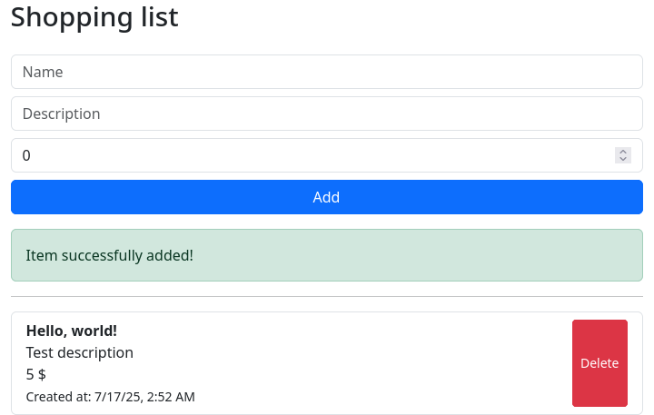

# Shopping list
Not for production, only for portfolio purposes.



Using Node.js and:
## Stack
```
/backend                     - express + sqlite3
/frontent/shopping-list-app  - angular + bootstrap
```
## How to run
Install git, Node.js, then run the following command in the terminal
```
npm install -g @angular/cli
```
to install Angular CLI (because we'll use `ng serve` later)
### Download the source
```
git clone <insert_this_page_url_here>
cd shopping_list
```
Don't type the triangle brackets, of course.
This is only here because I don't wanna depend on GitHub too much
and may want to move/copy this project elsewhere.
The project name is also subject to change.
### Run the backend (use a terminal)
```
cd backend
npm install
node server.js
```
and don't close the terminal, until you want to shut down the backend.
### Run the frontend (use another terminal)
```
cd frontend/shopping-list-app
npm install
ng serve
```
and don't close the terminal, until you want to shut down the frontend.
### Open http://localhost:4200/ in the browser
## P.S.
Suggestions welcome
